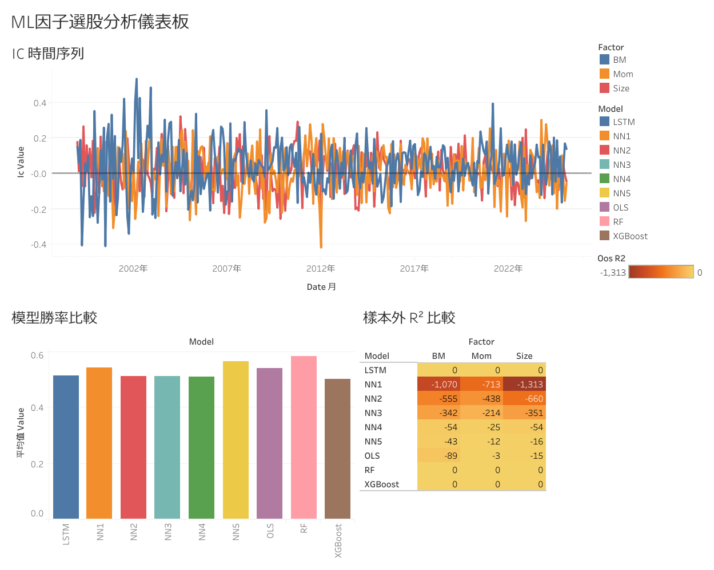

# 因子投資與機器學習：台灣股市多空組合策略

> 本 repo 為「金融科技創新與應用」課程期末報告完成後，另行整理的 Python 實作版本。原始報告（含 Excel 手動分析流程與完整結果）請參閱 [金融科技創新與應用期末報告.pdf](金融科技創新與應用期末報告.pdf)。

以三大量化因子（規模、帳面市值比、動能）的資訊係數（IC）時間序列為輸入，訓練多種機器學習模型預測下一期 IC，並據此建構多空投資組合，比較各模型在台灣股市的選股績效。

## 互動式儀表板

[](https://public.tableau.com/views/ML_17778235978420/sheet3)

📊 [在 Tableau Public 檢視完整互動式儀表板](https://public.tableau.com/views/ML_17778235978420/sheet3)



儀表板包含三個視圖：
- **IC 時間序列**：三因子（BM、Momentum、Size）資訊係數的月度走勢（1999–2025）
- **模型勝率比較**：9 種模型的多空策略平均勝率
- **樣本外 R² 比較**：各模型 × 各因子的預測能力熱力圖

## 研究概述

### 因子定義

| 因子 | 計算方式 |
|------|----------|
| Size（規模）| log(市值 × 10⁶) |
| BM（帳面市值比）| 1 / 股價淨值比 |
| Momentum（動能）| ln(P[t-1] / P[t-12]) |

### 資料來源

- **TEJ（台灣經濟新報）**：台灣上市公司 900+ 檔，1999/01 ~ 2025/02
- 資料涵蓋收盤價、市值（百萬元）、股價淨值比三張工作表
- ⚠️ 原始資料受 TEJ 授權限制，未納入本 repo；如需執行程式請自行準備並命名為 `taiwan_stock_data.xlsx`

### 模型列表

| 模型 | 說明 |
|------|------|
| OLS | 普通最小二乘迴歸 |
| RF | 隨機森林（100 棵樹）|
| NN1 ~ NN5 | 神經網路（從 [8] 到 [32,16,8,4,2] 逐漸加深）|
| XGBoost | 梯度提升樹 |
| LSTM | 長短期記憶網路（hidden size=32）|

所有模型採 **expanding window** 滾動訓練，預測區間為 **2013/12 ~ 2025/01（共 134 期）**。

### 投資組合建構

- 每期選 `|IC_pred|` 最大的因子進行股票排序
- 比較 13 種組距（每組 1 ~ 96 檔股票，對應分 10 ~ 964 等份）
- 多空策略：預測 IC 為正 → 買高因子值、賣低；反之對調

### 績效指標

- 勝率（Win Rate）
- 年化夏普比率（Annualized Sharpe Ratio）
- 累積報酬率（Cumulative Return）
- 樣本外 R²（Out-of-Sample R²）

## 檔案結構

```
├── step1_data_prep.py        # 因子計算 & Spearman IC 時間序列產生 → ic_data.csv
├── step2_ml_portfolio.py     # ML 模型 & 投資組合建構（模組化版本）
├── main_analysis.py          # 完整分析主程式（整合全流程）→ results_portfolio.csv, results_r2.csv
├── prepare_tableau_data.py   # 將結果轉為 Tableau 長格式 CSV → tableau_*.csv
├── test_ols_rf.py            # 快速驗證流程（僅跑 OLS / RF）→ results_ols_rf.csv
├── visualization.py          # 視覺化圖表產生（6 張圖）
├── 金融期末報告.pdf           # 完整研究報告
└── .gitignore
```

## 執行方式

```bash
# 步驟一：計算三因子 IC 時間序列
python step1_data_prep.py
# 輸出: ic_data.csv

# 步驟二：執行全部模型並輸出績效結果
python main_analysis.py
# 輸出: results_portfolio.csv, results_r2.csv

# 步驟三：產生 Tableau 匯入用 CSV
python prepare_tableau_data.py
# 輸出: tableau_ic_series.csv, tableau_performance.csv, tableau_r2.csv

# 步驟四：產生視覺化圖表
python visualization.py
# 輸出: fig1_IC_series.png ~ fig6_winrate_lines.png
```

> 快速測試可改跑 `python test_ols_rf.py`（只跑 OLS 和 RF，速度較快）

## 相依套件

```
pandas
numpy
scikit-learn
xgboost
tensorflow
scipy
matplotlib
seaborn
openpyxl
```

```bash
pip install pandas numpy scikit-learn xgboost tensorflow scipy matplotlib seaborn openpyxl
```

## 報告

詳細研究方法、實驗設計與結果分析請參閱 [金融科技創新與應用期末報告.pdf](金融科技創新與應用期末報告.pdf)。
